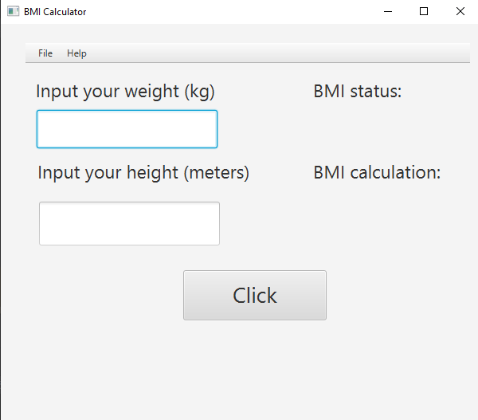
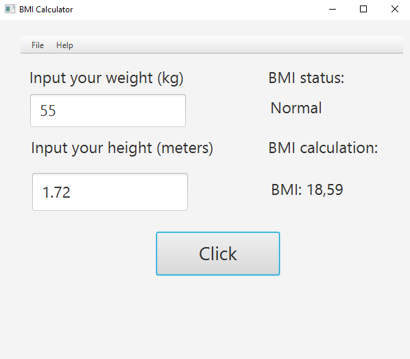
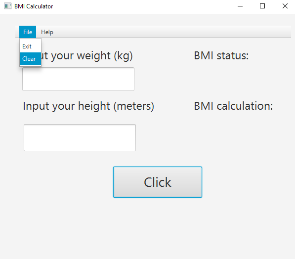
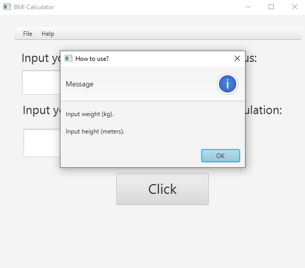
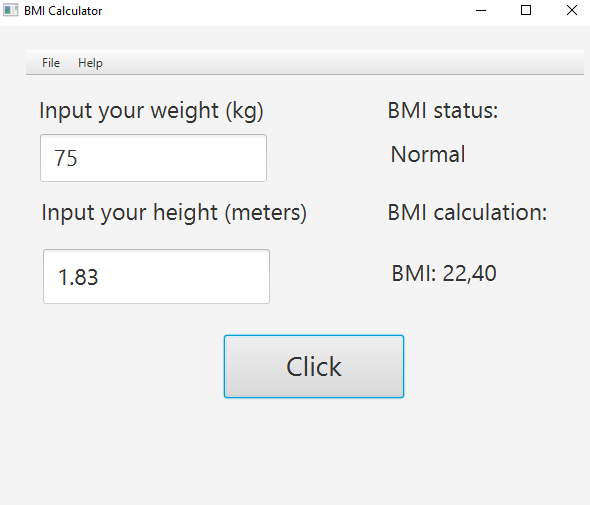

# BMI Calculator

A simple JavaFX application for calculating the Body Mass Index. This project will accept a user's weight and height and return their BMI and categorize them accordingly into Underweight, Normal, Overweight, or Obesity.

## Screenshots

## Features

- Calculate BMI using weight (kg) and height (meters).
- Display BMI category.
- Clear fields.
- Help guide for users who don't know how to use the application.
- Close the application.

## Requirements

- Java Development Kit (JDK) 8 or higher
- JavaFX SDK
- SceneBuilder (For design your scene)

## Project Structure

The project includes:
- `HelloController.java`: Handles the application's logic and interactions.
- `hello-view.fxml`: The FXML file defines the layout for the user interface.
- `HelloApplication.java`: Launches the JavaFX application.

## Run

1. Run the `HelloApplication.java`.
2. The JavaFX window should appear, and fill the forms.

# Explanation

Below is a simple JavaFX application-a BMI Calculator-Spring Boot application managed by the class HelloController, including UI elements wired with the use of @FXML. The implemented methods are: the clearFields() that cleans the text fields and labels; closeItem() to let the user close the application; showHelp() to instruct the user on how to input weight and height; and onClickButton() retrieves the weight and height from the text fields and then converts these into double variables, after which the computation of BMI is performed as bmi = weight / height², showing thereafter the computed value of BMI. This program classifies the result using calculated BMI as follows: "Underweight" in the case of less than 18.5, "Normal" from 18.5 up to 24.9, "Overweight" from 25 to 29.9, and "Obesity" if 30 or higher. In order to implement this application, there has to be an FXML file that will define the UI with appropriate components: text fields, labels, and buttons.

## Usage

- **Calculate BMI**: Enter the weight in kilograms and height in meters, then click the "Click" button.
- **Clear Fields**: Click the "Clear" button to reset the form.
- **Help**: Click the "Help" button for usage guide.
- **Close Application**: Click the "Close" button to close the form.
